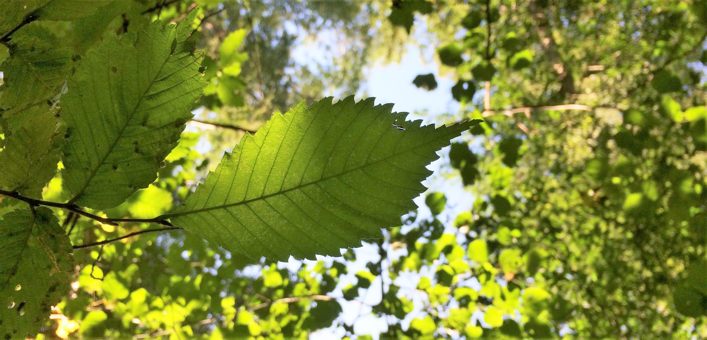
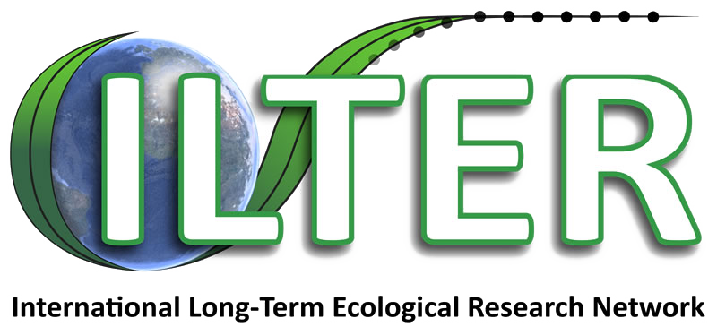

<h1 class="project-title">A Europe-wide Dendroecological Network for <em>Ulmus laevis</em></h1>

## Project

This ILTER-funded project establishes a Europe-wide tree-ring network for *Ulmus laevis*. It is open to researchers, forestry practitioners, conservationists, and other interested contributors.

ElmNET will provide a harmonized dataset to assess growth, vitality, and climate sensitivity across the species’ distribution range.

## Background

*Ulmus laevis* remains understudied in dendroecology and forest management. Unlike *Ulmus glabra* and *Ulmus minor*, which were severely affected by Dutch elm disease, it appears comparatively resilient, but large-scale evidence is lacking.

The species occupies a broad ecological gradient: from swamp forests and forested peatlands on organic soils, through riparian forests with fluctuating water levels and periodic flooding, to drier forests on mineral soils and wastelands.

Tree-ring data from these contrasting habitats will reveal regional and habitat-specific growth patterns and responses to climatic extremes, hydrological change, and other environmental pressures.

## Goals

ElmNET aims to:

* establish a harmonized, geographically extensive tree-ring network for *Ulmus laevis*;
* use and strengthen the ILTER network by linking research sites, researchers, and monitoring infrastructures;
* quantify regional and habitat-specific differences in growth, vitality, and climate sensitivity;
* distinguish macroclimatic, microclimatic, and hydrological controls on tree growth;
* identify particularly vulnerable and resilient populations;
* promote collaboration and standardized data collection across the species’ range.

