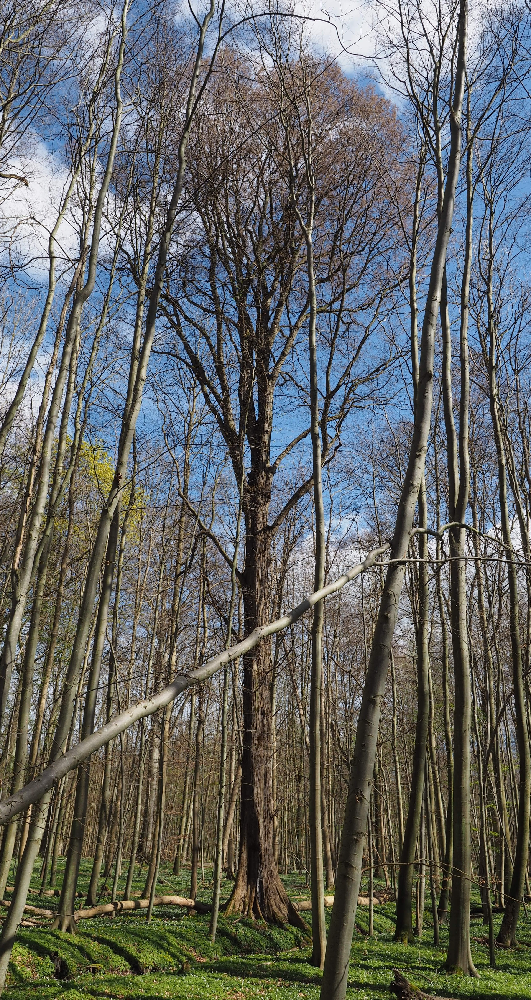

We actively welcome collaboration with researchers, institutions, and tree-ring laboratories throughout the distribution range of *Ulmus laevis*.

Contributions may consist of previously measured tree-ring series or newly collected increment cores. Sites from underrepresented regions and environmentally unusual locations, particularly dry sites, are especially valuable for the network.

**At least 15 sampled trees per site are required, ideally accompanied by metadata and stand information.**

Researchers interested in contributing data or sampling additional sites are invited to contact the project coordinator.

---

**Elm species identification (guide in German):**

[Identification guide for the three native elm species](https://www.waldwissen.net/de/wald/baeume-und-waldpflanzen/laubbaum/die-drei-heimischen-ulmenarten){target="_blank"}
